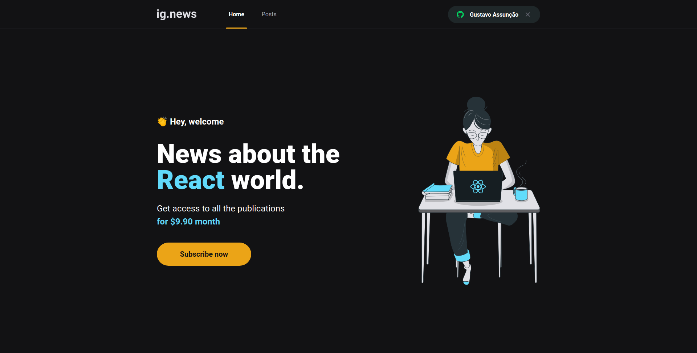
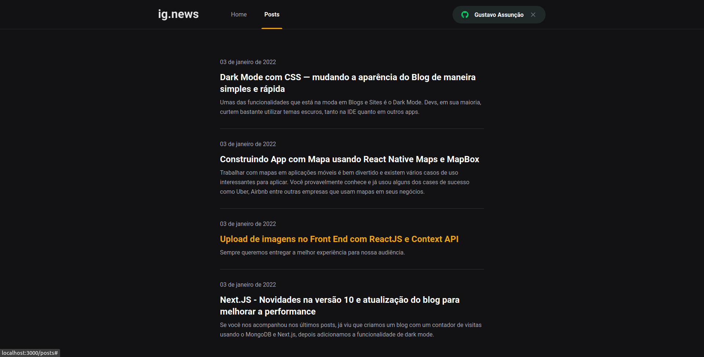
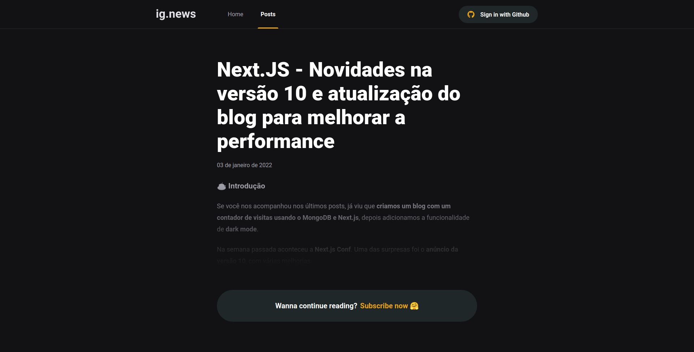
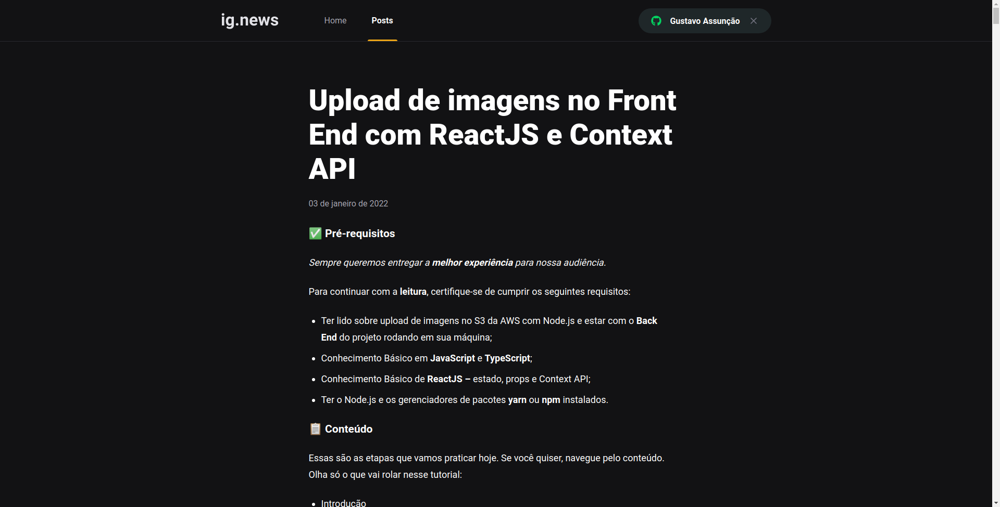

   

   

	
   
  
  
  

  👏  Projeto desenvolvido durante o Bootcamp Ignite da | <a href="https://github.com/Rocketseat">@Rocketseat</a>

   Made with 💖 by
    <a href="https://github.com/gustavogk"> Gustavo Assunção.
    <h1></h1>
  

  
# 📌 Contents

* [Technologies](#rocket-technologies) 
* [Screenshots](#camera-screenshots) 
* [License](#page_facing_up-license)
  
# :rocket: Technologies
This project was made using the follow technologies:

* [Typescript](https://www.typescriptlang.org/)      
* [React](https://reactjs.org/)      
* [NextJS](https://nextjs.org/)
* [FaunaDB](https://fauna.com/)
* [Stripe](https://stripe.com/en-mx/)
* [Prismic](https://prismic.io/)
  
# :camera: Screenshots
  

   
   
   
   

  
# :page_facing_up: License

This project is under the [MIT license](./LICENSE).
Made with 💖 by [Gustavo Assunção](https://www.linkedin.com/in/gustavo-gk/). 

Thank you! 🌠
